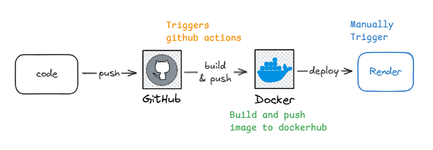
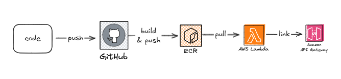

# Kaya


## Getting Started

### Prerequisites
- Python 3.10.15
- Docker
- PostgreSQL database [https://neon.tech/]

### Installation & Running (Locally)
1. Clone the repository
2. Set up environment variables (Copy .env.example to .env and set the variables)
    - `DATABASE_URL` will be provided
3. Build the Docker image
    ```bash
    docker build -t usekaya:latest .
    ```
4. Run the Docker container
    ```bash
    docker run --name kaya-container -p 8000:8000 --env-file .env usekaya:latest
    ```
----
### Running the tests
Run the following command to run the tests
```bash
pytest
```

### Current Architecture

```
1. Setup Github Actions (CI only)
2. Setup repository secrets in github
3. Push code to github and CI pipeline triggered
4. Integrate pytest inside CI
5. Build and push image to Dockerhub
6. Authenticate Dockerhub with Render
7. Trigger manually to deploy from render dashboard
8. Setup Render Webhook to trigger on push to Github (Automatic Deployment)
9. Copy the URL and done.
```


### AWS Architecture

```
1. Create repository in ECR
2. Setup Github Actions (As previous)
3. Authenticate ECR
4. Tag the image and push to ECR
5. Create Lambda using ECR image
6. Create API Gateway
7. Choose Lambda and configure routes
8. Copy the URL and done.
```

------------------------------------------
### Things to improve
- Integrate https://oneuptime.com/ for logging, monitoring and alerting
- Setup pre-commit hooks
- Improve tests
- API Authentication
